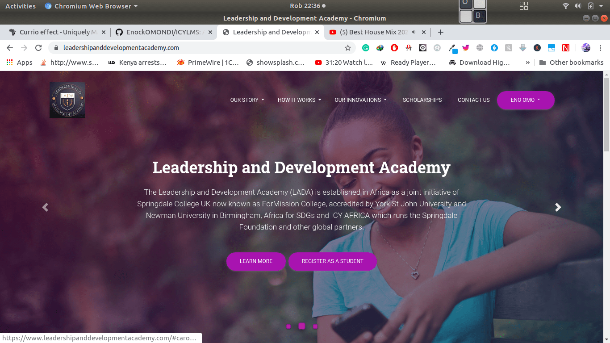
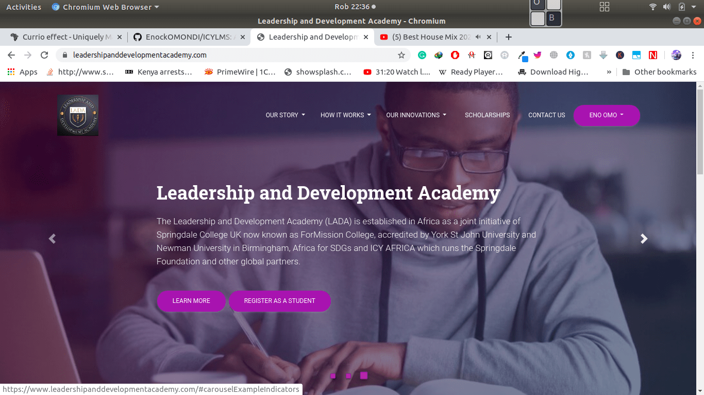
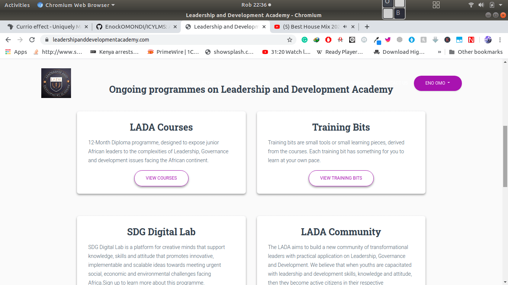

# LEADERSHIP AND DEVELOPMENT ACADEMY COURSE MANAGEMENT SYSTEM
#### A piece of software that functions as a virtual classroom for learners and a management hub for administrators. This app makes it possible to easily keep track of course administration, documentation, reporting and delivery, all from one central control panel.

#### By ****Enock OMONDI****

## Requirements
* Browser
* Good internet connection

## How to use as a user
* Open the site - link [here](https://www.leadershipanddevelopmentacademy.com/)
* Create an account if you are new or login to application
* Create a profile 
* Search for a course to enroll
* add to cart and submit to make an order
* proceed with payments handled by paypal
* after succesfull payment you will recieve an email with login details for your course

<!-- ## How to use as admin
* Open the site - link [here]()
* login to application
* Search for different orders made
* Click on desired Item order to process
*  -->

## Technologies used
* django-rest-framework  - The web framework used
* aws-s3
* material-design
* Python - Language
* html/css/bootstrap4- Used for-frontend
* Postgresql-Database
* paypal payment gateway

###### Deployment
* HEROKU
* AWS

### KNOWN BUGS
- no known bugs

 
Github - [Enock OMONDI](https://github.com/EnockOMONDI)

### License
This is an opensource software therefore the license is [MIT](https://choosealicense.com/licenses/mit/)
 
Copyright (c) 2020 